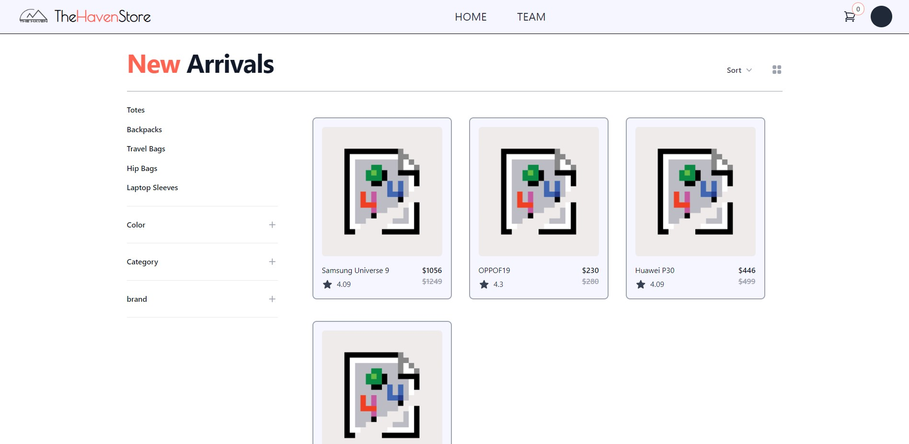
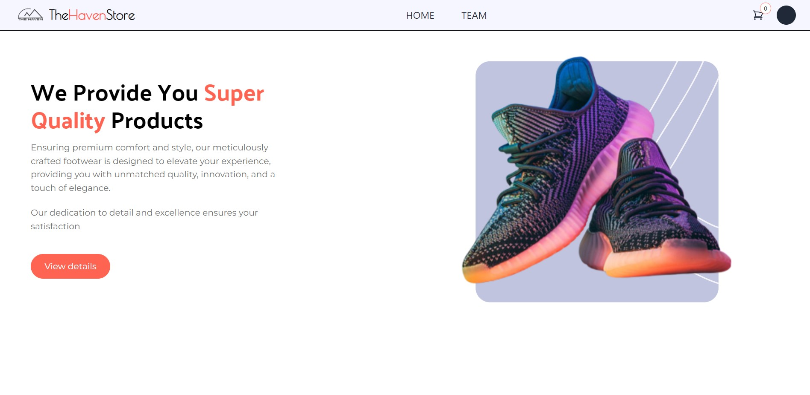
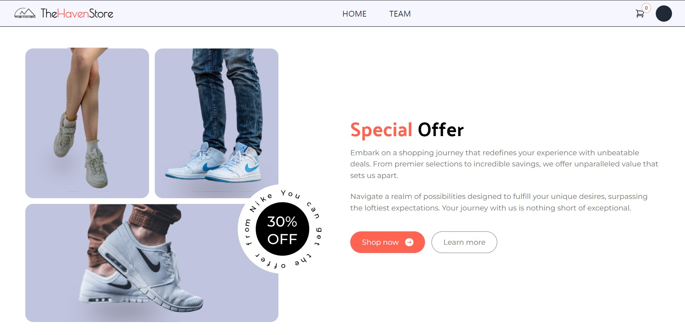
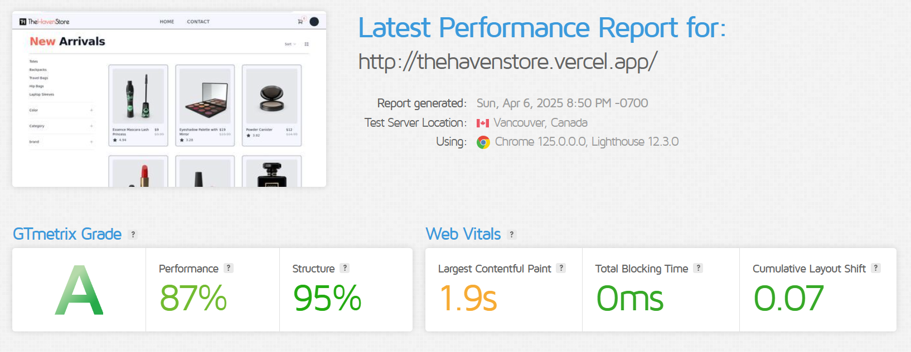

# The Haven Store - E-Commerce Frontend

> This repository contains only the frontend of this E-Commerce application.
> To explore the backend, visit the [Ecom Backend Repository](https://github.com/Ash-0803/ecom-backend).

While this project is not yet deployed, you can view working demonstrations and screenshots below.

## 📸 Screenshots & Previews

The application has undergone UI enhancements while maintaining core functionality. Below are screenshots of key sections:

|                      Landing Page                      |                  Quality Section                  |               Product Catalog               |
| :----------------------------------------------------: | :-----------------------------------------------: | :-----------------------------------------: |
|  |  |  |

## ✨ Dynamic UI & Interactions

### Landing Page Animation


### Authentication Flow

The application features a complete authentication system with user registration and login functionality. User data is securely stored in the database.


### Smart Pagination & Filtering

The application implements API-driven pagination and filtering, allowing for efficient data loading and browsing. This approach enhances performance and provides a smoother user experience.


## 🚀 Key Features

- **Responsive Design**: Optimized for all device sizes
- **Modern UI**: Clean, intuitive interface with smooth transitions
- **Authentication**: Secure user registration and login
- **Product Management**: Browsing, filtering, and cart functionality
- **Order Processing**: Complete checkout flow with order confirmation
- **Dynamic Filtering**: Real-time product filtering and sorting
- **Contact Form**: Integrated messaging system for customer support

## 🔧 Technology Stack

- React.js
- Redux & Redux Toolkit for state management
- Tailwind CSS for styling
- React Router for navigation
- EmailJS for contact form functionality

## 🏁 Getting Started

This project was bootstrapped with [Create React App](https://github.com/facebook/create-react-app), using [Redux](https://redux.js.org/) and [Redux Toolkit](https://redux-toolkit.js.org/).

### Installation & Setup

1. Clone the repository
2. Install dependencies:
   ```bash
   npm install
   ```
3. Start the development server:
   ```bash
   npm start
   ```

The application will run at [http://localhost:3000](http://localhost:3000).

> **Note**: This application requires the backend server to be running. You can find the backend repository at [Ecom Backend](https://github.com/Ash-0803/ecom-backend).

## 📊 Performance Metrics

_Our application is optimized for speed and efficiency:_



We have used [GTmetrix](https://gtmetrix.com/) for detailed analysis.
